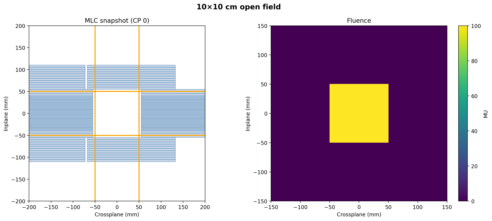

# Summary

Machine quality assurance (QA) of linear accelerators (linacs) is a critical
component of safe and effective external beam radiation therapy (RT). QA
procedures often require the delivery of standardized treatment plans to verify
machine performance, including geometric accuracy, dosimetric consistency, and
imaging system alignment. As QA methodologies evolve, new test patterns and
procedures are regularly introduced, increasing the need for flexible and
extensible approaches to plan generation. While the Digital Imaging and
Communications in Medicine (DICOM) standard defines how radiotherapy treatment
plans (RT Plans) should be represented [@NEMA_DICOM], constructing valid RT Plan
files for QA purposes is challenging due to the complexity of the standard and
the need for machine-specific configurations.

Conjuror is a Python toolkit that enables the creation of DICOM RT Plans
tailored for Varian linac machine QA. The toolkit provides an accessible and
reproducible way to generate test plans for routine and specialized QA
procedures, eliminating the need for manual authoring or reliance on
proprietary planning systems.

# Statement of need

Routine and end-to-end QA of linacs requires standardized test plans that
examine key performance characteristics, such as multileaf collimator (MLC)
positioning, imaging isocenter coincidence, and mechanical accuracy. These
requirements are formalized in guidelines such as AAPM Task Groups 142
[@TG142], 198 [@TG198], and 332 [@TG332], as well as AAPM Medical Physics
Practice Guidelines 8.a [@MPPG8a] and 8.b [@MPPG8b]. The implementation and
interpretation of these QA procedures are primarily the responsibility of
medical physicists involved in clinical operations, commissioning, and ongoing
QA. Beyond routine compliance testing, contemporary machine QA increasingly
involves systematic studies that characterize machine behavior under controlled
parameter variations, supporting the evaluation of performance across a range of
delivery configurations.

In current clinical and research practice, medical physicists typically
generate QA plans either by (1) manual construction within proprietary
treatment planning systems, or (2) by relying on vendor-provided test plans.
These approaches can be time-consuming, opaque, and difficult to adapt or
update in response to institution-specific protocols, research studies, newly
proposed QA methodologies, or emerging technologies. Such local customization
is explicitly encouraged in guidance such as AAPM-RSS Medical Physics Practice
Guideline 9.b [@MPPG9b], which recognizes the need for institution-specific QA
strategies in advanced techniques such as SRS and SBRT. Additionally, QA
plans are often distributed across multiple files, making it cumbersome to
assemble all required beams in a single cohesive plan and hindering
streamlined, automated workflows.

Conjuror addresses this gap by offering an open-source, Python-based framework
for generating DICOM RT Plans specifically for Varian linacs. An open-source
approach is particularly valuable for machine QA, as it enables transparency in
plan construction, reproducibility of QA procedures across institutions, and
community-driven development as new tests and measurement patterns are
introduced. By exposing plan generation through a programmable interface,
Conjuror supports both routine clinical QA and research into novel QA
strategies. The library enables:

* Customization of commonly used QA plans based on pre-prepared procedures.
* Aggregation of multiple procedures into a single RT plan file, enabling a
  streamlined QA workflow.
* Visualization of the expected fluence and the sequence of control points of
  each beam (\autoref{fig:open_field}).
* Integration with Python QA ecosystems (e.g. Pylinac [@Kerns2023]), supporting
  automated analysis and research into novel QA strategies.
* Built on established Python packages such as pydicom [@Mason2022], ensuring
  compatibility with the broader medical imaging software ecosystem.

# State of the field

Several open-source projects address aspects of linac QA, but none focus on
generating valid DICOM RT Plan objects for test delivery. For example, pylinac
[@Kerns2023] and pymedphys [@Biggs2022] provide robust tools for analyzing
machine QA data but assume that test plans have already been generated and
delivered. As a foundational dependency, pydicom [@Mason2022] enables reading
and writing of DICOM files, but it does not provide domain-specific
functionality for radiotherapy QA plan creation.

In contrast, Conjuror bridges this gap by directly supporting the
programmatic generation of DICOM RT Plans for Varian linac QA. By enabling
the creation of test plans that can be delivered, analyzed, and iteratively
refined, Conjuror helps complete the QA workflow from plan generation through
delivery and assessment. This focus on reproducible, automated test plan
creation complements existing QA analysis software and contributes to a more
complete open-source ecosystem for medical physics research and clinical
practice.

# Software design

- **RT beams:** A `Beam` represents a DICOM RT Beam and defines its Control
  Point Sequence (monitor units, MLC/jaw positions, gantry/collimator/couch
  axes).
- **QA procedures:** A `QAProcedure` groups one or more `Beam` instances into
  domain-specific tests (e.g., a Winston–Lutz procedure with multiple beams at
  different gantry/collimator/couch angles).
- **Plan synthesis:** A `PlanGenerator` builds an RT Plan dataset containing
  all beams across procedures. Since a QA procedure is not part of the DICOM
  RT Plan hierarchy, beams are stored as a sequential list.
- **Fluence simulation (dosimetric verification):** An imager simulator
  computes expected beam fluence from control points using configurable pixel
  sampling and source-to-imager distance, supporting verification of intended
  dose delivery patterns.
- **Motion and control-point visualization (geometric verification):** Plotting
  helpers (Plotly) enable animation of MLC motion and visualization of
  control-point dynamics to inspect beam geometry and sequencing behavior.

# Research impact statement

Conjuror enables QA procedures to be defined and customized programmatically,
allowing researchers and clinical physicists to generate reproducible RT Plan
variants for systematic testing. By facilitating controlled variation of beam
delivery parameters, the toolkit supports QA studies that systematically
explore machine behavior across different delivery configurations. This
capability accelerates the development, refinement, and assessment of novel
QA strategies by reducing the overhead associated with plan creation. Conjuror
has been applied in a collaborative workflows to generate customized plans for
testing a range of delivery types, including VMAT, static open fields, and
MLC-based test patterns such as picket-fence fields, across multiple settings
beyond the fixed configurations available in vendor-provided QA plans.

# AI usage disclosure

No generative AI tools were used in the conceptual design or QA procedure
domain logic. Generative AI was used to assist with code suggestions (e.g.,
unit-test scaffolding) and language polishing of this manuscript; all changes
were reviewed by the authors.

# Acknowledgements

We thank Radformation for continuing to support the open-source work of this
project.

# References
